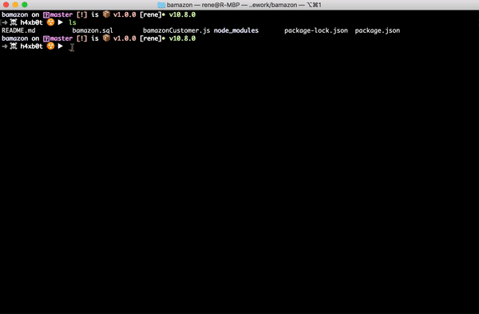

# Bamazon

Bamazon is a terminal-based application which simulates the Amazon storefront.

## Requirements

- [Node](https://nodejs.org/)

- [MySQL](https://www.mysql.com/)

- [MySQL Workbench](https://www.mysql.com/products/workbench/)

- [inquirer](https://www.npmjs.com/package/inquirer)

- [mysql](https://www.npmjs.com/package/mysql)

- [console.table](https://www.npmjs.com/package/console.table)

## Installation

Node and MySQL should be installed first.

You can download the latest version of Node from [here](https://nodejs.org/). Get MySQL Community Server [here](https://dev.mysql.com/downloads/mysql/).

Once you have installed both, download [MySQL Workbench](https://www.mysql.com/products/workbench/) and run the queries in bamazon.sql file.

Then install the inquirer, mysql and console.table libraries by typing the following commands in the terminal:

`npm install inquirer --save`

`npm install mysql --save`

`npm install console.table --save`

## Using the App

To run the app, go to application folder where you cloned or downloaded the app and in the terminal and type this:

`node bamazonCustomer`
